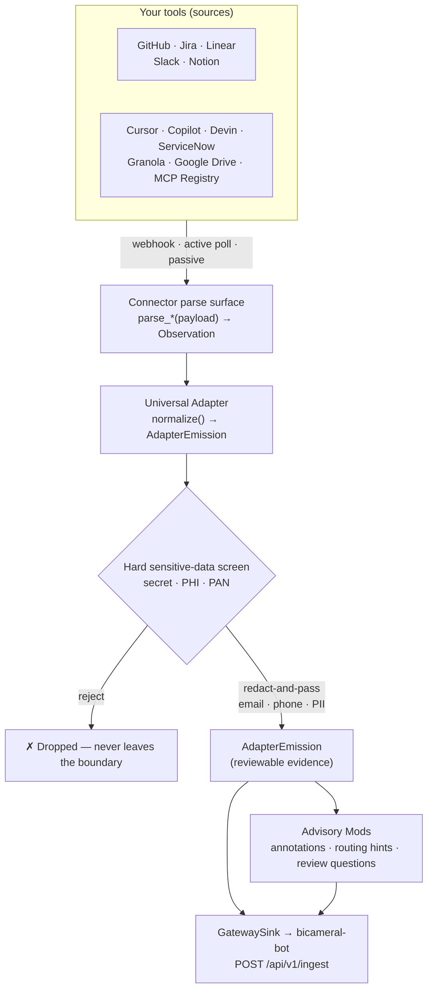
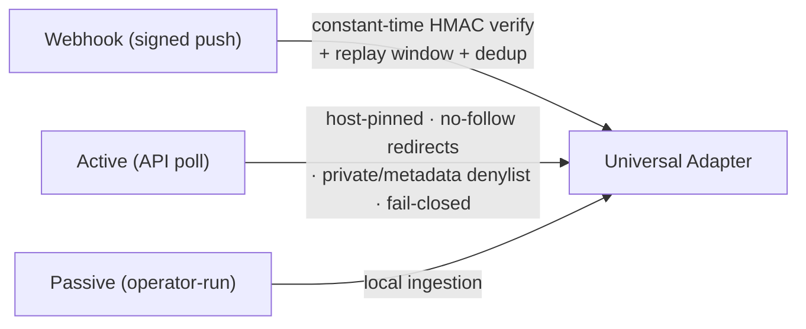
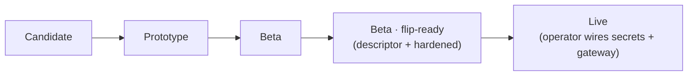

# Bicameral Integrations

> **Read-only evidence adapters that turn the tools your team already uses — Jira, Linear, GitHub, Slack, Notion, Zendesk, Sentry, PagerDuty, and more — into provider-neutral, governed evidence. Built to be the safe, expressive edge of Bicameral: they observe, never act.**

<!-- CI / security posture -->
[](https://github.com/BicameralAI/bicameral-integrations/actions/workflows/ci.yml)
[](https://github.com/BicameralAI/bicameral-integrations/actions/workflows/governance-gate.yml)
[](https://github.com/BicameralAI/bicameral-integrations/actions/workflows/codeql.yml)
[](https://github.com/BicameralAI/bicameral-integrations/actions/workflows/security-scan.yml)
[](https://github.com/BicameralAI/bicameral-integrations/actions/workflows/scorecard.yml)

<!-- project signals -->
[](connectors/README.md)
[-2ea44f.svg)](#design-principles)
[](https://mypy-lang.org/)
[](https://github.com/astral-sh/ruff)
[](https://www.conventionalcommits.org)
[](https://www.python.org/downloads/)
[](LICENSE)
[](CONTRIBUTING.md)
[](SECURITY.md)

**Bicameral Integrations** is the open-source library of **source adapters** and **EM-safe advisory mods** for [Bicameral](https://github.com/BicameralAI). Integrations are the expressive edge of the system: they understand Jira, Linear, Slack, Notion, GitHub, Zendesk, support email, meetings, and customer-specific workflows — and they translate that signal into typed, hash-chainable evidence. **They never own canonical state.**

| | |
|---|---|
| **Maturity** | Beta — 26 connectors harness-proven end-to-end, **all 26 flip-ready** (config descriptor + adversarially hardened, ready for an operator to flip Live), and **13 EM-safe advisory mods** are built; a PII redaction-and-pass model lets PII-dense free-text be emitted safely; the Live gateway-emission seam is implemented (`GatewaySink` → `POST /api/v1/ingest`) and operator-actionable |
| **Footprint** | Zero third-party **runtime** dependencies (Python stdlib only) |
| **Safety model** | Read-only evidence adapters ([ADR-0008](docs/adr/0008-integrations-are-evidence-adapters-not-state-authorities.md)); fail-closed webhook signature verification; a producer-side secret/PII hard-screen on every emission |
| **Assurance** | Hash-chained governance ledger + machine-verified CI gate; SHA-pinned Actions; CodeQL, Bandit, OpenSSF Scorecard, SBOM |

## Design Principles

- **Evidence, not authority.** Every connector is read-only; it emits observations and never writes canonical decisions or takes action (that boundary belongs to [`bicameral-mcp`](https://github.com/BicameralAI/bicameral-mcp)). See [ADR-0008](docs/adr/0008-integrations-are-evidence-adapters-not-state-authorities.md).
- **Library, not a server.** Connectors are a pure parse surface; the operator's host owns the live HTTP/poll boundary via the thin [`runtime/`](runtime/README.md) layer ([ADR-0012](docs/adr/0012-connector-readiness-ladder-and-live-ingest-runtime.md)). Result: **zero runtime dependencies**.
- **Config as a contract.** Each connector publishes a machine-readable descriptor (`connectors/<id>/config.json` + the aggregated `connectors/index.json`, schema-validated in CI) declaring its credentials, scopes, webhook receiver, and step-by-step setup — the single source the [`bicameral-mcp`](https://github.com/BicameralAI/bicameral-mcp) UI renders (see [`docs/UI_RENDERING_SPEC.md`](docs/UI_RENDERING_SPEC.md)). This repo ships the contract and never holds a secret value.
- **Headless, not UI-blocked.** Connectors and mods run from a local file config via `python -m runtime.cli` (`list` / `run` / `run-mods`), so an operator can wire and test a source without waiting on any UI.
- **Fail closed.** Webhook signatures are verified with constant-time HMAC before a payload is parsed; any secret/PII/PAN in an emission is hard-screened (`FX-SEC-001`) before it can leave the boundary.
- **Earned readiness.** Connectors advance `Candidate → Prototype → Beta → Live` only on a real end-to-end harness proof, not a status flip ([ADR-0012](docs/adr/0012-connector-readiness-ladder-and-live-ingest-runtime.md)).
- **Provable, not asserted.** Every change is sealed into a SHA-256 hash-chained ledger that CI re-verifies on every push.

## Key Features

- **Source adapters** – transform external tool payloads into typed Bicameral objects.
- **EM-safe mods** – lightweight YAML/prompt/fixture packages for dependency risk, security mentions, routing hints, and review suggestions.
- **Gateway compatibility** – every adapter targets `bicameral-bot/protocol/` contracts.
- **Source evidence preservation** – adapters preserve excerpts, refs, source type, timestamps, and prompt/manifest versions where relevant.
- **Trust-tier configuration** – high-signal sources can auto-create candidates; noisy sources can require manual gating.

## High-level Architecture

Every source flows through one neutral pipeline: a connector parse surface produces a provider-neutral `Observation`, the universal adapter normalizes it to an `AdapterEmission`, a hard sensitive-data screen rejects anything carrying a secret/PHI/PAN (and redact-and-pass scrubs email/phone from free text), and only then is evidence handed to advisory mods and the gateway.



**Inbound trust boundary** — each mode is authenticated/constrained before a payload is parsed:



## Repository Layout

```text
├── adapter/                 # Universal adapter: neutral object model + normalization pipeline
│   └── core/                # Shared contracts (Observation, AdapterEmission, capabilities)
├── connectors/              # Provider-facing parse surfaces (one folder per source)
├── mods/                    # EM-safe advisory mods and fixtures
├── docs/                    # Governance artifacts, ADRs, integration strategy, compliance mappings
├── scripts/                 # Governance gate + CI helper scripts (with tests/)
├── .github/workflows/       # CI gates + reusable (`workflow_call`) gate templates (_reusable-*.yml)
└── README.md                # You are here
```

## Connectors

Each connector is a provider-facing **parse surface** — `parse_*(payload) -> Observation` plus a `<Provider>Connector` class — feeding the [universal adapter](adapter/README.md) (`pipeline.normalize()`). All connectors are read-only evidence adapters; they never write canonical state ([ADR-0008](docs/adr/0008-integrations-are-evidence-adapters-not-state-authorities.md)). Readiness follows the [connector readiness ladder](docs/adr/0012-connector-readiness-ladder-and-live-ingest-runtime.md) (`Candidate → Prototype → Beta → Live`); **Beta** = proven end-to-end through the [`runtime/`](runtime/README.md) harness against a reference sink (signed webhook → verify → normalize → emit), with no cross-repo dependency. **Live** (gateway emission) is now operator-actionable — the `GatewaySink` seam maps each emission to the v1 `IngestRequest` and POSTs it to `/api/v1/ingest` (bot ingest guards landed); a connector goes Live when an operator wires `GatewaySink(endpoint, token)` against a real gateway. See [`connectors/README.md`](connectors/README.md) for the full index.

### Flip-ready — capability matrix

**All 26 connectors** carry a machine-readable config descriptor, adversarial security hardening, and an operator runbook — ready to flip Live. Going Live is the operator's action: they supply their own credentials and wire `GatewaySink(endpoint, token)`; this repo holds no secret.



| Connector | Data in | Data out (neutral evidence) | Mode · security & PII |
|---|---|---|---|
| [linear](connectors/linear/) | Linear issues / issue events | `issue` — id, title, description, url | Webhook (`Linear-Signature` HMAC) + active (GraphQL, host-pinned); actor real name dropped |
| [google_drive](connectors/google_drive/) | A Google Doc | `document` — title + body text | Active; OAuth Bearer, fixed Docs host, id-validated; hard-screen backstop |
| [devin](connectors/devin/) | Devin coding sessions | `session` — redact-and-passed free text | Active; Bearer service-user key, host-pinned `api.devin.ai` |
| [cursor](connectors/cursor/) | Per-developer daily usage rows | `usage_metrics` — **PII-free** counts + opaque id | Active; HTTP Basic, host-pinned; email/name never read |
| [copilot](connectors/copilot/) | Org aggregate Copilot metrics | `usage_metrics` — **PII-free**, no per-person data | Active; Bearer `read:org`, host-pinned `api.github.com` |
| [servicenow](connectors/servicenow/) | ServiceNow incidents | `incident` — redact-and-passed summary/description | Active; HTTP Basic; instance injection-validated + private/metadata denylist; caller never read |
| [granola](connectors/granola/) | Meeting notes + transcript | `transcript` — redact-and-passed; owner dropped | Passive; Bearer, host-pinned `public-api.granola.ai` |
| [mcp_registry](connectors/mcp_registry/) | Public MCP server registry | `mcp_server` — redact-and-passed public text | Active; no credential (public data) |
| [github](connectors/github/) | Pull-request events | `pull_request` — redact body + title; public author login | Webhook (`X-Hub-Signature-256` HMAC, verify-before-parse); body-hash dedup |
| [jira](connectors/jira/) | Jira issue created/updated/deleted | `issue` — redact summary; ADF body never read; actor dropped | Webhook (`X-Hub-Signature` HMAC, WebSub); dedup |
| [slack](connectors/slack/) | Channel messages (Events API) | `message` — redact text; opaque user-id | Webhook (`v0` HMAC over `v0:{ts}:{body}` + 5-min replay) |
| [notion](connectors/notion/) | Page-change events | page-changed **pointer** keyed by stable page id | Webhook (`X-Notion-Signature` HMAC); body-hash dedup |
| [fathom](connectors/fathom/) | Meeting transcripts + summaries | `meeting` — redact-and-passed transcript; speaker + recorder names dropped | Passive + Webhook (`whsec_` HMAC over `{id}.{ts}.{body}`, 5-min replay); `X-Api-Key` poll |
| [claude_code](connectors/claude_code/) | Claude Code session transcripts (local JSONL) | `user`/`assistant`/`summary` turns — redact-and-passed content | Passive (local file import); no credential; `cwd` username scrubbed; FX-SEC-001 hard-screen |
| [zendesk](connectors/zendesk/) | Support-ticket webhook events | `ticket` — redact-and-passed subject + body; requester an opaque id | Webhook (`X-Zendesk-Webhook-Signature` Base64 HMAC over `{ts}{body}`); body-hash dedup; active REST poll deferred |
| [local_directory](connectors/local_directory/) | Files dropped in a watched directory | `planning` — redact-and-passed content + filename stem | Passive (local file import); no credential; path sha256-tokenized; FX-SEC-001 hard-screen |
| [aider](connectors/aider/) | Aider-attributed git commits | `commit` — redact-and-passed subject; author name retained as provenance | Passive (local git import); no credential; opaque hash floor; FX-SEC-001 hard-screen |
| [gitlab](connectors/gitlab/) | Merge-request / issue webhook events | `merge_request`/`issue` — redact body + title; public username | Webhook (`X-Gitlab-Token` plaintext shared secret, constant-time); event-UUID dedup; active REST poll deferred |
| [sentry](connectors/sentry/) | Issue webhook events | `issue` — redact exception message + culprit; full stack trace never read | Webhook (`Sentry-Hook-Signature` hex HMAC over raw body); Request-ID/body-hash dedup |
| [pagerduty](connectors/pagerduty/) | v3 incident webhook events | `incident` — redact title/summary; no actor surfaced | Webhook (`X-PagerDuty-Signature` `v1=` multi-sig HMAC membership); event-id dedup |
| [osv](connectors/osv/) | OSV.dev vulnerability records | `vulnerability` — redact summary/details; severity/packages/aliases metadata | Active (free unauthenticated query API, host-pinned); no credential |
| [sarif](connectors/sarif/) | SARIF 2.1.0 static-analysis findings | `finding` — redact result message; **a secret in a finding is scrubbed but kept, not dropped**; snippet never read | Passive (file import); no credential; FX-SEC-001 hard-screen |
| [anthropic_admin](connectors/anthropic_admin/) | Anthropic org usage/cost metrics | `usage_metrics` — **PII-free** token totals + models; opaque workspace/key ids never surfaced | Active; `x-api-key` admin key (`sk-ant-admin…`), host-pinned |
| [openai_admin](connectors/openai_admin/) | OpenAI org audit-log events | `audit_event` — type + project + time; **actor email/id/IP never read** | Active; Bearer admin key, host-pinned `api.openai.com` |
| [continue_dev](connectors/continue_dev/) | Continue.dev dev-data events (local JSONL) | `development_data` — redact prompt/completion; opaque userId | Passive (local file import); no credential; operator `level:noCode` strips at source |
| [confluence](connectors/confluence/) | Confluence Cloud pages | `page` — redact title + body | Active + Passive (REST poll, API-token Basic / OAuth, host-pinned `*.atlassian.net`); Connect-app-JWT webhook deferred |

### Future Development

**None — all 26 connectors are flip-ready.** The descriptor fan-out is complete: every harness-proven parse surface now carries a config descriptor, adversarial security hardening, and an operator runbook. New connectors are added demand-driven (read-only evidence → this repo; interactive action → `bicameral-mcp`).

Selection criteria and trust tiers: [Integration Candidate Catalog](docs/INTEGRATION_CANDIDATE_CATALOG.md) · [Trust Tier Model](docs/TRUST_TIER_MODEL.md). Provider-evidence vs. agent-action surface choice: the [interactivity-test triage](docs/INTEGRATION_STRATEGY_AND_CANDIDATE_HARVESTING.md).

## Mods

Mods are **EM-safe advisory packages** — all **13 are built and wired** — that read the neutral evidence stream and emit annotations, routing hints, owner-lens hints, and suggested review questions only; they never write canonical decisions (see [Mod Safety Contract](#mod-safety-contract)). Every mod output passes the same secret/PHI/PAN hard-screen. Each links to its scope spec.

| Mod | Advises on |
|---|---|
| [adapter_contract](mods/adapter_contract/) | Evidence-shape & contract-preservation risks in connector/adapter output |
| [authority_boundary](mods/authority_boundary/) | Changes that may cross authority, trust-tier, or canonical-state boundaries |
| [code_review_risk](mods/code_review_risk/) | PR-level review risk (the first mod family behind the Bicameral Review Bot, [ADR-0011](docs/adr/0011-bicameral-review-bot.md)) |
| [connector_freshness](mods/connector_freshness/) | Stale provider assumptions in connector docs, fixtures, auth notes, parser scope |
| [data_classification](mods/data_classification/) | Classifying sensitive evidence before routing / outbound notification |
| [decision_drift](mods/decision_drift/) | New evidence that conflicts with recorded decisions, ADRs, trust tiers |
| [dependency_risk](mods/dependency_risk/) | Dependency upgrade, pin, SDK-drift, compatibility-risk signals |
| [noisy_source_gate](mods/noisy_source_gate/) | Manual-gating high-noise sources (Slack/email/meetings) unless trust is raised |
| [ownership_routing](mods/ownership_routing/) | Reviewer-lens & domain-ownership suggestions from changed paths + evidence |
| [security_mentions](mods/security_mentions/) | Auth, token, secret, PII, webhook-verification, transport-exposure signals |
| [source_trust_calibration](mods/source_trust_calibration/) | Calibrating source trust by provenance, type, historical noise, sensitivity |
| [test_adequacy](mods/test_adequacy/) | Missing/weak tests around changed behavior, parsing, fixtures, gates |
| [webhook_risk](mods/webhook_risk/) | Webhook safety: signature verification, replay, schema, idempotency, side effects |

## Related Repositories

- [`bicameral-bot`](https://github.com/BicameralAI/bicameral-bot) – local daemon/gateway and embedded protocol contracts.
- [`bicameral-mcp`](https://github.com/BicameralAI/bicameral-mcp) – agent-facing tool surface; not a source-adapter repo.
- [`bicameral-cloud`](https://github.com/BicameralAI/bicameral-cloud) – hosted code graph/oracle; not the adapter host by default.

## Mod Safety Contract

Mods may emit candidates, evidence, hints, dependency signals, advisories, and suggested review commands. Mods may not write `.bicameral/decisions/*.yaml`, approve signoff, mark compliance resolved, create blocking CI results directly, collapse confidence surfaces, or bypass governance policy.

## Testing

```bash
pytest -q adapter/core/tests connectors scripts/tests
```

Governance integrity (ledger hash-chain + feature-index test paths) is verified
separately and in CI:

```bash
python scripts/governance_gate.py
```

## CI Gates

Every change runs through SHA-pinned GitHub Actions gates, several of which are
also published as reusable `workflow_call` templates (`.github/workflows/_reusable-*.yml`)
for the wider Bicameral ecosystem:

- **lint + type + test** (ruff, mypy, pytest) · **Governance Gate** (ledger hash-chain + feature-index)
- **CodeQL** · **Bandit** · **Security Scan** · **OpenSSF Scorecard** · **SBOM + attestation** · **dependency-review** · **secret scan** (TruffleHog)
- **Quality** (workflow-YAML lint, codespell, SPDX headers) · **PR hygiene** (conventional title)

Framework control mappings (OWASP, NIST AI RMF & SSDF, EU AI Act, SOC 2, GDPR/HIPAA)
live in [`docs/compliance/`](docs/compliance/) — control alignment, not certification.

## Documentation

- **Architecture & decisions**: [ADRs](docs/adr/) — incl. [0004 adapter boundary](docs/adr/0004-integration-adapter-boundary.md), [0005 emission contract](docs/adr/0005-adapter-emission-contract.md), [0006 active/passive/webhook modes](docs/adr/0006-active-passive-webhook-modes.md), [0008 evidence-not-authority](docs/adr/0008-integrations-are-evidence-adapters-not-state-authorities.md), [0009 trust-tiered governance](docs/adr/0009-trust-tiered-integration-governance.md), [0012 readiness ladder + runtime boundary](docs/adr/0012-connector-readiness-ladder-and-live-ingest-runtime.md)
- **Contracts**: [Governed Adapter Contract](docs/GOVERNED_ADAPTER_CONTRACT.md) · [Trust Tier Model](docs/TRUST_TIER_MODEL.md) · [Data Classification & Redaction](docs/DATA_CLASSIFICATION_AND_REDACTION.md)
- **Strategy & catalog**: [Integration Strategy & Candidate Harvesting](docs/INTEGRATION_STRATEGY_AND_CANDIDATE_HARVESTING.md) · [Integration Candidate Catalog](docs/INTEGRATION_CANDIDATE_CATALOG.md) · [Integration Docs Index](docs/INTEGRATION_DOCS_INDEX.md)
- **Feature & state**: [Feature Index](docs/FEATURE_INDEX.md) (every feature → a test) · [System State](docs/SYSTEM_STATE.md) · [Backlog](docs/BACKLOG.md)
- **Governance internals**: [Governance Index](docs/GOVERNANCE_INDEX.md) · [Meta Ledger](docs/META_LEDGER.md) (hash-chained) · [Shadow Genome](docs/SHADOW_GENOME.md) (lessons) · [Compliance mappings](docs/compliance/) · [Ecosystem gate adoption](docs/ecosystem/)
- **Components**: [adapter/](adapter/README.md) · [connectors/](connectors/README.md) · [runtime/](runtime/README.md)

## Project Governance

- [Contributing](CONTRIBUTING.md)
- [Security Policy](SECURITY.md)
- [Changelog](CHANGELOG.md)
